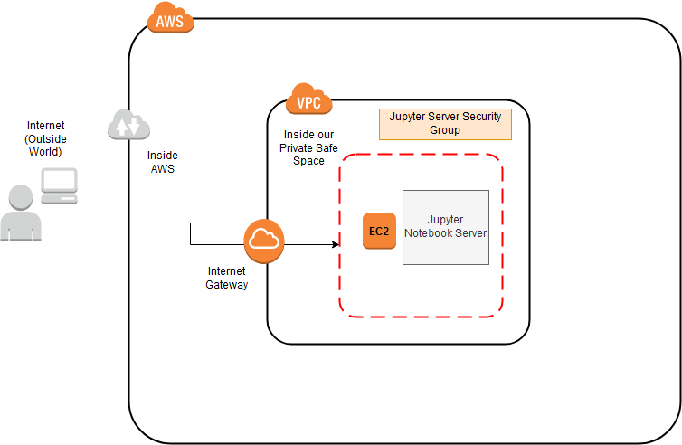

#  :cloud: Create scalable Jupyter Notebook on Cloud :orange_book:

## Made on August, 5, 2019

Simple Step-by-Step Guide to make portable Jupyter Notebook server that is accessible from anywhere and easily scalable on AWS EC2.

## Pre-requisites:

1. Create [AWS Account](https://aws.amazon.com/), you would need a valid Credit Card.

> NOTE: If you are student Sign-Up through [AWS Educate](https://aws.amazon.com/education/awseducate/)

2. If on Windows, install <a href="https://www.chiark.greenend.org.uk/~sgtatham/putty/latest.html">PuTTY </a>

---

## I. Register for AWS

1. Start with registering for AWS account, if you have already registered, sign-in.

You should now be on **AWS Management Console**, as of now it should look like this:


---

## II. Create VPC

Goal here is to create a safe space to launch our Jupyter Notebook Server, to do so, we will create a our Virtual Private Cloud (VPC) where we will launch the EC2 instance (i.e. Virtual Machine).

Our AWS Architecture should look something like this:




Since, there is no cost for creating VPCs, you can create each for your project or deploying application.

1. Before we start note your **AWS Region** in top-right, mine is `Ohio`, yours could be any one of the following, if you want to change, stick with the closest one.


2. Search for `VPC` in **Find Services** search box:


It should take you to something like this:


3. Easiest way from here on is clicking on `Launch VPC Wizard` button, that will take you to:

- Step 1: Selecting a VPC Configuration, where you would click on the blue `Select` button, since we only need a single EC2 instance that is publicly accessible.


> Selecting it, would create a Public Subnet where instances can have inbound connection from the outside world which will allow us to SSH into the servers and access website using HTTP/HTTPS protocols, along with outbound internet access needed to update and download repository/packages for us.

- Step 2: VPC with a Single Public Subnet

> Everything should be left default values, don't change anything expect giving it a VPC name, `Jupyter VPC`.


After naming the `VPC`, click on `Create VPC` button. After it sucessfully creates the VPC, you should see a confirmation, in green text, and information to `Launch an Instance into Your Subnet`.


- Step 3: Click `Ok` and navigate back to **AWS Management Console**.

---

## III. Provision an EC2 Instance

1. Search for `EC2` in the search box from the **AWS Management Console**, which should take you to, **EC2 Dashboard**:


2. Again the easiest way is to click on the big blue button, `Launch Instance`,

- Step 1. Choose an Amazon Machine Image (AMI)

Since, we would be working with `Linux`, Ubuntu is my preference for installing necessary packages and Anaconda distributions.


> Make sure the radio-button is selected to `64-bit (x86)`

- Step 2. Choose an Instance Type

Leave everything here default (as is), and click on the button highlighted in the red box below:


> Leave the selection to default `t2.micro` as it is `free-tier`, and since we would just be installing packages and configuring the instance we don't need a powerful server yet. For more information on pricing check out this link: 
https://aws.amazon.com/ec2/pricing/on-demand/

- Step 3: Configure Instance Details

> Play close attention to highlted red boxes in image below, you should match those settings.


**Settings that needs to be changed:**

  - a. Under `Network` drop-down box, select our `Jupyter VPC`
  - b. Enable `Auto-assign Public IP`
  - c. Advanced Details / Boostrap Scripts
 :point_right: Not done yet, *scroll all the way down to bottom of the page*, and un-collapse `Advanced Details` tab, which should drop down text-box called `User data`.
 


:point_right: Copy paste below commands into `User data` text-box.

```bash
#!/bin/bash
curl https://repogen.simplylinux.ch/txt/bionic/sources_f2be9cfad2f632b6f9d6fc0eea6ad4a35d70929d.txt | sudo tee /etc/apt/sources.list
sudo apt-get update -y
sudo apt-get install git -y
sudo apt-get install ufw -y
sudo ufw allow ssh
sudo apt autoremove -y
```
> This will run the installations we need prior to SSH'ng to EC2 instance.

:point_right: Click, `Next: Add Storage` button

- Step 4. Add Storage *(Optional)*

**Optional Settings you can change:**

- Update Size column from 8 GB to 30 GB of SSD, leave everything else to defaults.

> Free tier eligible customers can get up to 30 GB of SSD storage, so what are you waiting for.


:point_right: Click, `Next: Add Tags` button

- Step 5. Add Tags *(Optional)* 

- I prefer organizing multiple instances with proper name tag, so let's add Key, Value tags like below:

  - **Key:** `Name`
  - **Value:** `Jupyter EC2 Server`


:point_right: Click, `Next: Configure Security Group` button

- Step 6: Configure Security Group

:rotating_light: :warning: **PAY ATTENTION TO THIS STEP** :warning: :rotating_light:

We will be creating a **new** security group, so make sure you follow below settings:

  - Assign a security group: `Create a new security group` radio button selected
  - Security group name: `jupyter-ec2-sg`
  - Add Rule: `HTTP` and `HTTPS`
  - Source: `Anywhere` for all the rows
 
 Exactly like this:
 
 
 
 Once, you have configured exactly like have, move onto next step, which is **Reviewing and Launching** our EC2 instance.
 
 :point_right: Click `Review and Launch` button
 
- Step 7: Review Instance Launch

:point_right: Click `Launch` button after you have verified the settings are correct, and matches based on steps we took.

- Step 8: Create a new Key Pair or Select an existing Key Pair

:rotating_light: :warning: **PAY ATTENTION TO THIS STEP** :warning: :rotating_light:

Unless this is not your first time, you will be prompted to create a new **Key Pair**.

  - Create a new key pair and make sure you name it `[name]-[region]-kp`, example, `jupyterec2-ohio-kp`, some thing like that.
  - :warning: **Download Key Pair, and Store in non-shared folder/drive** :warning:, don't loose it.
  
- Step 9. Wait

Once, you have sucessfully launched the EC2 instance you should see something like this.

:point_right: Select, `View Instances` button

3. Once your are on **EC2 Dashboard** wait till Instance State is indicated with green light :green_heart:.

## IV. Provision the Jupyter Server

1. SSH into EC2

SSH means "secure shell", where you can remotely connect your server and type commands into.

For: 
  - Mac / Linux users: use Terminal
	
      - Step 1. Locate your ec2 ip in `Description` tab under `Public DNS(IPv4)`.
    
     - Step 2. Note
       - Denotes: 
         -  `<your_ec2_ip>`
         -  `<your_private_key>.pem`
    - Step 3. Navigate to your SSH key folder and type following commands to SSH into EC2
      ```terminal
      $ cd path/to/my/ssh-key-folder
      $ chmod 400 <your_private_key>.pem
      $ ssh ubuntu@<your_ec2_ip> -i <your_private_key>.pem
      ```
      
  - Windows users: use PowerShell or PuTTy
  
  :warning: For Windows users, before you connect your private key that you created needs to be converted to PuTTY format using PuTTY gen.

  Follow the **Prerequisites** part of this guide: https://docs.aws.amazon.com/AWSEC2/latest/UserGuide/putty.html

2. Verify the installs

```terminal
$ sudo apt-get update -y
``

